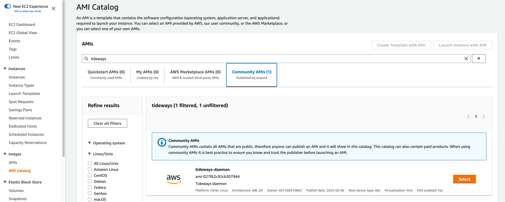

# Tideways daemon AMI

To use the AMI, either:

- search for "tideways" in [the AWS AMI catalog](https://console.aws.amazon.com/ec2/v2/home?#AMICatalog)



- or use directly the AMI ID that matches your region (e.g. in `serverless.yml` or a CloudFormation template):

| Region    | AMI ID                |
|-----------|-----------------------|
| us-east-1 | ami-0745f53b30dee1da0 |
| us-east-2 | ami-09a9452d5dc73b16e |
| us-west-1 | ami-06e9be7060d9d73b5 |
| us-west-2 | ami-0249de177862ed370 |
| ca-central-1 | ami-0b72999bef36c3289 |
| eu-west-1 | ami-0ad66fb5f377b2880 |
| eu-west-2 | ami-07be17b51f12ab23d |
| eu-west-3 | ami-094bf9a2c06706506 |
| eu-central-1 | ami-00ff596413bd5db58 |
| eu-north-1 | ami-071ce88b50eb082c7 |
| sa-east-1 | ami-0e53c6c54b83a5860 |
| ap-northeast-1 | ami-0f5b90f99c90ef4d2 |
| ap-northeast-2 | ami-06c80393a378990ec |
| ap-northeast-3 | ami-04cde2246a7a973c9 |
| ap-southeast-1 | ami-0a3501e5a5fd3b1ab |
| ap-southeast-2 | ami-082f02486897974eb |
| ap-south-1 | ami-051234e9428424b58 |

To get the AMI ID for your region, you can alternatively run:

```
aws ec2 describe-images \
    --filters 'Name=name,Values=tideways-daemon' \
    --owners='601180370863' \
    --query='Images[*].[ImageId]' \
    --output=text \
    --region=YOUR_REGION_NAME
```

## How it works

The Tideways daemon AMI starts from the base Ubuntu Server 22.04, x86 so that it can run on t2.micro (free tier).

We can create an AMI whose filesystem is either:

- EBS storage (mounted filesystem)
- Instance-store storage

We will use the first option. While it sounds extra steps for un-necessary storage, EBS AMIs are more standard, easier and faster to create, boot faster, can be paused, etc. It also allows to use much slower EC2 instance types, like `t2.micro` which is eligible for the free tier.

### Setup

First, install [the `packer` CLI](https://developer.hashicorp.com/packer/tutorials/aws-get-started/get-started-install-cli).

Then, run `packer init` to install dependencies:

```bash
packer init .
```

Check the configuration is valid:

```bash
packer validate .
```

### Building the AMI

Build the AMI image by running:

```bash
packer build .
```

An EC2 instance will be booted (from the base Ubuntu AMI), and the provisionning scripts will run in that instance. An AMI will be created from that instance. The instance will then be terminated.

The created AMI will be marked as "public".

Full docs: https://developer.hashicorp.com/packer/tutorials/aws-get-started/aws-get-started-build-image
